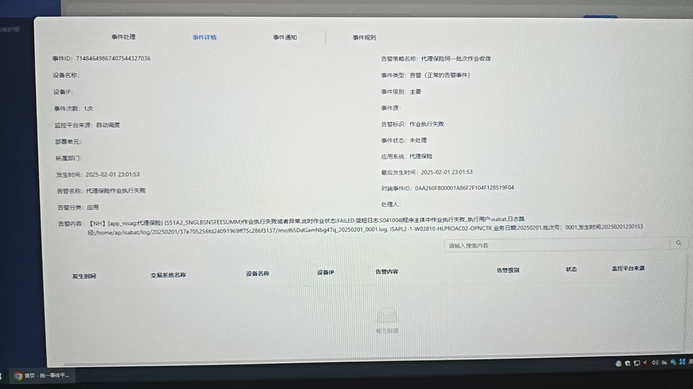
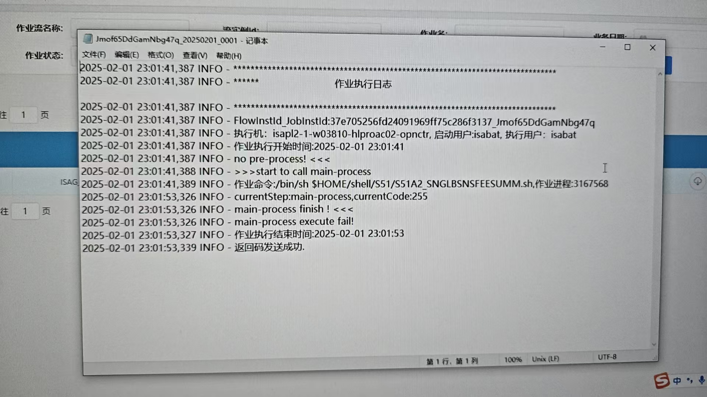
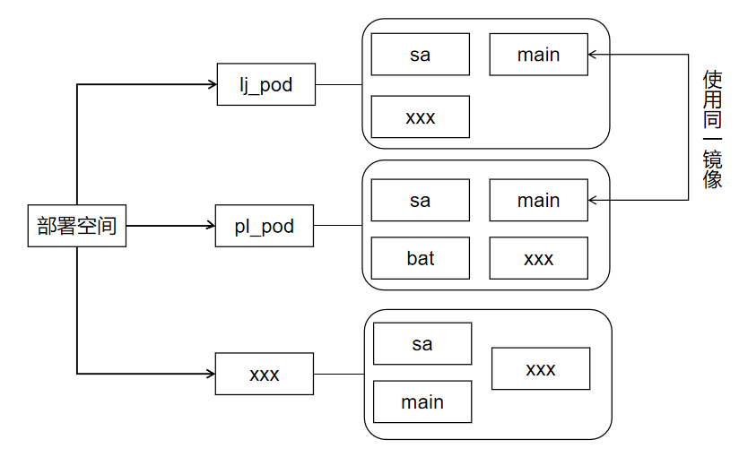
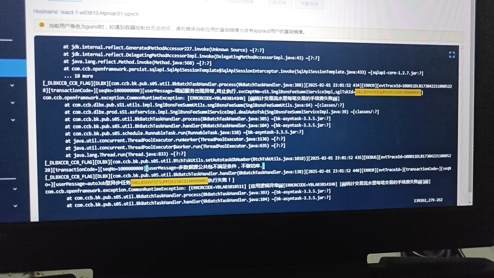
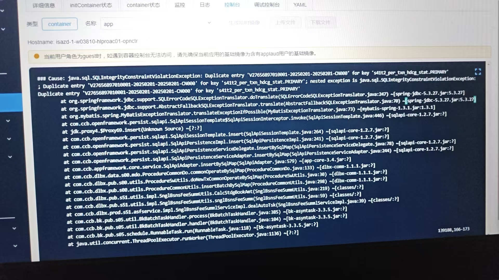
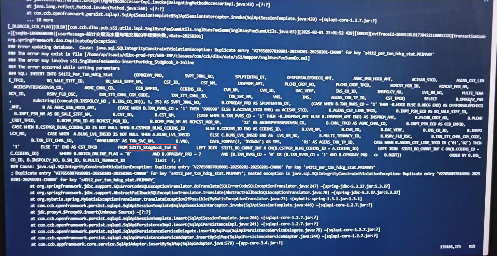

鲁班批量报错排查
====================
鲁班批量报错后，一线会立即通知，会在群里发一张带有错误的截图。但该错误一般只是简单\
提示，无助于定位根本问题，需要去鲁班容器中进一步排查。

以代理保险作业报错为例
-----------------------------

孔明监控平台中的错误详情：

----

在鲁班系统中可下载并查看批量运行日志：

查看批量脚本的错误日志
---------------------------
鲁班批量一般会在各自系统的容器中运行，需要去对应的容器中查看日志。

找到执行机
^^^^^^^^^^^^^^^ 
  
如上图中的日志：本次失败作业的执行机在\
**isapl2-1-w03810-hproac02-opnctr**\
的部署空间中。

.. hint::

  一般即时交易类的错误，在lj_pod中，批量作业的报错，在pl_pod中。

找到具体的作业日志
^^^^^^^^^^^^^^^^^^^^^^^^^^^^^^^^^^^^
进入到\
**isapl2-1-w03810-hproac02-opnctr**\
的部署空间中，找到带有\
**pl**\
标识的pod，进入该pod中的\
**bat**\
容器中查看日志。

在执行用户的Home目录下有一个log目录，日志路径与执行脚本的路径相似，如本次作业的执行路径为：

.. code:: bash

  $HOME/SHELL/S51/S51A2_SNGLBSNSFEESUMM.sh

那么它的日志路径就是

.. code:: bash

  $HOME/log/当天日期/S51/S51A2_SNGLBSNSFEESUMM.log

**$HOME**
是一个环境变量，它的实际路径为
**/home/ap/xx**
，xx是执行用户的用户名。

因此完整的路径为：

.. code:: bash

  /home/ap/isabat/log/20250201/S51/S51A2_SNGLBSNSFEESUMM.log

拿到自动任务号
^^^^^^^^^^^^^^^^^^^^^
即使从作业日志中找到当日日志，依然不能定位问题，该日志一般只是记录自动任务的任务号，\
仍然无法定位错误原因，不过这个自动任务号是用来定位错误原因的关键，\
如本次作业失败的自动任务号为：\

.. code:: bash

  S51A2_SNGLBSNSFEESUMM2025020100000001

鲁班平台发起调用，脚本会在批量容器中执行，不过它会发起一个自动任务，\
但该任务却在同POD中的联机容器（main）中执行，因此需要使用这个自动任务号去联机容器中\
搜索该自动任务的详细日志，这里会记录本次鲁班任务错误的根本原因。

.. important::

  执行机与负责联机的容器在同一个PL POD中，可点击链接查看\
  `POD`_\
  与\
  `容器`_\
  的区别。

  .. _POD: https://kubernetes.io/zh-cn/docs/tutorials/kubernetes-basics/explore/explore-intro/#kubernetes-pod
  .. _容器: https://docs.docker.com/get-started/docker-overview/

使用拿到的自动任务号搜索排查
^^^^^^^^^^^^^^^^^^^^^^^^^^^^^^

使用\
``grep``\
去联机容器中的日志目录中查看批量任务报错时的日志，如\

.. code:: bash

  grep 'S51A2_SNGLBSNSFEESUMM2025020100000001' dlbx_app_all.log*

此时就会找到该自动任务号具体位于哪一个分割日志中。

使用 ``vim`` 打开该日志，并使用自动任务号搜索，便可以找到批量任务

.. hint:: 

  部分系统容器的语言码格式不是默认的UTF8，进入这些日志查看时，中文内容会显示为\
  乱码内容，此时需要使用\
  ``:set encoding=utf8``\
  设置编码为UTF8，即可正常显示中文内容。
  
  ``vim``\
  中搜索时，可以使用\
  ``:set hlsearch``\
  进行搜索高亮显示，有助于快速看到指定的搜索内容。

该错误一般是\
``java exception``\
抛出的大量错误日志，根据自动任务号关联的 ``eventTraceId`` 去日志中查看具体原因：

如本次错误就是因为一个\
``Duplicate entry``\
引发的，因此需要进一步排查出现数据重复的原因。
  
根据事件追踪号追查更多信息
---------------------------
根据最初的自动任务号查找到的错误日志，可以找到一个事件追踪号：

如上图中的事件追踪号是：\
``evtTraceId-108011DLB1738422118805228``\
，需要使用这个追踪号去日志中进一步搜索。

通过事件追踪号找到了以下日志：

根据该日志，猜测系统将上游数据加载到中间表，用于批量处理，但在加载过程中发生主键重复\
的问题，导致任务失败，进而导致整个作业流停止。

此时需要根据搜索出的SQL找到上游表，根据SQL分析，该SQL使用的是\
``INSERT INTO xxx SELECT xxx FROM xxx``\
进行查询插入的，因此上图中的上游表是\
``S21T1_StdgBook_Inf``，\
需要排查该表发生了什么错误。

与项目组协助排查
---------------------------
系统中有成百上千张表，每张表少则十几个字段，多则几十个字段，\
此时我们很难知晓这些数据的处理逻辑，需要项目组协助排查。

.. hint:: 

    在联系项目组之前尽可能的把问题查到更深层次的地方，否则项目组就位后，有\
    时候也很难确定发生了什么，此时在项目组的指导下排查问题反而更费时间。

此时项目组还会根据具体的问题进一步查看其它细节，最终给出问题的解决方案。如\
本次的问题解决方案是删除重复数据，重跑批量任务。
